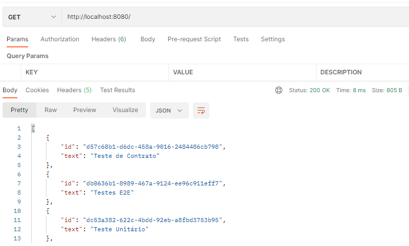

# webService-restAssured-test
Projeto: Web service REST com um banco de dados usando Spring Boot e Rest Assured

### Tecnologias e FrameWorks

* [Kotlin](https://kotlinlang.org/)
* [Rest Assured](http://rest-assured.io/)

### Subir o serviço
Rodar No terminal o seguinte comando:
> ./gradlew bootRun

***Obs. Rodar o projeto no java 11***

Assim que o aplicativo for iniciado, abra a seguinte URL: http://localhost:8080.

### Rodar Carga Inicial no banco de Dados h2
Rodar os curl's existente no arquivo ***resources/sql/CargaInicial.txt*** no postman

### Executando os Testes

### Analise de Código
Projeto configurado no sonarCloud
* [Sonar Cloud](https://sonarcloud.io/project/overview?id=diegomachadoti_webService-restAssured-test)

### Referência
* [toolsqa](https://www.toolsqa.com/rest-assured-tutorial/)
* [kotlinlang](https://kotlinlang.org/docs/jvm-spring-boot-restful.html#execute-http-requests)
